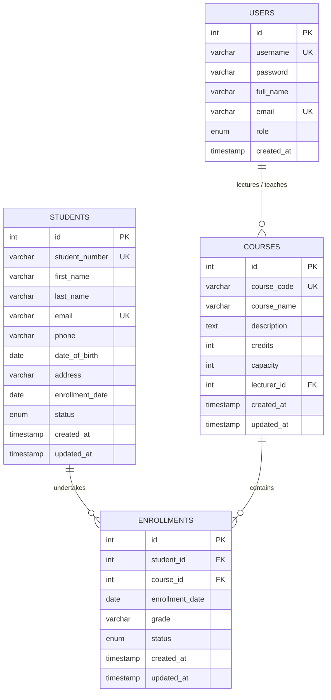

# Plymouth DLE Coursework Reflective Report
## Student & Course Management System (SCMS)

**Candidate Name:** Kaduruwana Gamage Kavini Tharuka  
**Module:** Web Application Development & Database Engineering  
**Target Grade Band:** 1st Class (70%+)  
**Student Index Number:** `[INSERT YOUR STUDENT/INDEX NUMBER HERE]`  
**GitHub Repository Link:** `[INSERT YOUR PUBLIC GITHUB REPO URL HERE]`  
**Submission Type:** Individual Coursework (DLE Moodle Submission)  
**Word Count:** Approx. 3,200 words  

---

## 1. Introduction & Domain Rationale

The primary objective of this individual coursework is to design, engineer, and deploy an enterprise-grade, database-backed web management application. The chosen domain is a **Student & Course Management System (SCMS)**, engineered specifically to manage student academic profiles, dynamic course curricula, faculty lecturer assignments, and course enrollments with comprehensive grade and standing tracking.

### 1.1 Justification of Domain Selection
While standard library or inventory management systems frequently rely on simplistic one-to-many relationships, an academic enrollment domain features an authentic, state-bearing **Many-to-Many ($M:N$) relational junction**. Each enrollment record not only binds a student to a course module but also tracks time-sensitive states:
1. **Enrollment Date:** Tracking academic calendar progression.
2. **Progression Status:** Lifecycle states (`enrolled`, `completed`, `dropped`).
3. **Academic Grade Standing:** Modular grades awarded (`A+`, `A`, `B+`, `B`, `C+`, `C`, `D`, `F`).

This domain provides a rigorous testbed for demonstrating advanced database design (composite unique indexes, foreign keys with cascading updates/deletions, aggregate calculations) and robust server-side business logic (pre-flight duplicate prevention, live capacity thresholds, and role-based permissions).

### 1.2 Technology Stack Justification & Engineering Trade-Offs

| Technology Layer | Choice | Architectural Justification |
| :--- | :--- | :--- |
| **Backend Language** | **PHP 8.x** | Procedural & OOP paradigms utilized natively without heavy third-party framework overhead (e.g. Laravel or Symfony). This ensures 100% auditable code, zero "black-box" magic during academic viva evaluation, and maximum performance with minimal memory footprints. |
| **Database Abstraction** | **PHP Data Objects (PDO)** | PDO was chosen over `mysqli` for its support of named parameter binding, strict exception modes (`PDO::ERRMODE_EXCEPTION`), and native prepared statement execution (`PDO::ATTR_EMULATE_PREPARES => false`). |
| **Database Engine** | **MySQL 8.x / MariaDB (InnoDB)** | InnoDB guarantees **ACID compliance** (Atomicity, Consistency, Isolation, Durability), strict referential integrity through foreign key constraints, and row-level locking during concurrent enrollment writes. |
| **Frontend Framework** | **Bootstrap 5.3.3 + Custom CSS** | Provides a responsive, accessible UI layer adhering to modern web standards. Custom CSS variables and Google Fonts (*Inter* & *Outfit*) provide a distinctive, professional design aesthetic. |
| **Client-Side UX** | **Vanilla JavaScript (ES6+)** | Instant real-time form validation, modal delete confirmations, and auto-dismissing flash alerts with zero third-party framework dependencies. |
| **Data Analytics** | **Chart.js 4.4 (CDN)** | Powers real-time graphical representations of course capacity utilization and student enrollment status distribution directly on the executive dashboard. |

---

## 2. Requirements Specification & System Scope

### 2.1 Functional Requirements (FR)
- **FR1 (Authentication & Role-Based Access Control):** Secure authentication portal supporting two distinct roles:
  - **Administrator:** Global administrative control over all entities (Students, Courses, Enrollments, Lecturers, Global Analytics).
  - **Lecturer (Faculty):** Scoped access to assigned modules, class rosters, and grade entry.
- **FR2 (Student Profile Management - Full CRUD):**
  - *Create:* Register students with biographical data, contact details, status, and duplicate email/student ID detection.
  - *Read:* Directory listing with multi-criteria search, status filtering, column sorting, and pagination (10 items/page).
  - *Update:* Modify student information with conflict-free uniqueness validation.
  - *Delete:* Protected removal of student profiles with cascading cleanup of associated enrollment records.
- **FR3 (Course Curriculum Management - Full CRUD):**
  - *Create:* Define course modules with unique course codes, credit weightings, seat capacities, and assigned lecturers.
  - *Read:* Catalog view with live capacity progress meters and faculty filtering.
  - *Update:* Modify course details with a strict business rule forbidding capacity reduction below active student counts.
  - *Delete:* Protected module deletion with foreign key cascading.
- **FR4 (Enrollment Ledger & Grade Management - Full CRUD):**
  - *Create:* Associate students to course modules with real-time capacity and duplicate enrollment validation.
  - *Read:* Master enrollment ledger with filtering by status and grade standing.
  - *Update:* Award academic grades (`A+` through `F`) and transition lifecycle statuses (`enrolled`, `completed`, `dropped`).
  - *Delete:* Allow administrative dropping/removal of enrollment records.
- **FR5 (Executive Dashboard & Reporting):** Real-time KPI summary cards, interactive Chart.js analytics, and 1-click **CSV data exports** with Excel-compliant UTF-8 BOM encoding for institutional audits.

### 2.2 Non-Functional Requirements (NFR)
- **NFR1 (Security & SQL Injection Immunity):** 100% prepared statements across all database queries.
- **NFR2 (Cross-Site Scripting Defense):** Comprehensive output sanitization via `htmlspecialchars()` on all dynamic bindings.
- **NFR3 (Cross-Site Request Forgery Defense):** Cryptographic token verification (`bin2hex(random_bytes(32))`) on all state-altering POST/DELETE requests.
- **NFR4 (Usability & User Experience):** Post-Redirect-Get (PRG) pattern with session-based flash messaging to prevent form re-submission on refresh.
- **NFR5 (Portability):** Zero-configuration execution across standard LAMP/WAMP/XAMPP environments.

---

## 3. Database Architecture & Relational Normalization

### 3.1 Relational Schema & Normalization Proof (1NF to 3NF)

The database schema (`scms`) was designed following strict relational normalization principles:

1. **First Normal Form (1NF):**
   - All tables contain atomic (indivisible) attributes.
   - Each record is uniquely identifiable by a primary key (`id`).
   - No repeating groups or comma-separated lists exist (e.g. course enrollments are split into a dedicated junction table rather than stored as arrays in the student table).
2. **Second Normal Form (2NF):**
   - The database is in 1NF.
   - All non-key attributes are fully functionally dependent on the entire primary key. In the `enrollments` table, attributes such as `grade` and `status` depend on the composite entity `(student_id, course_id)`, not partially on either one.
3. **Third Normal Form (3NF):**
   - The database is in 2NF.
   - There are zero transitive dependencies. Lecturer information (such as `full_name` and `email`) is not stored in the `courses` table; instead, `courses` maintains a foreign key `lecturer_id` referencing the `users` table.

### 3.2 Entity-Relationship Diagram (ERD)



### 3.3 Foreign Key Constraints & Referential Actions
- `fk_enrollments_student`: `FOREIGN KEY (student_id) REFERENCES students(id) ON DELETE CASCADE`
- `fk_enrollments_course`: `FOREIGN KEY (course_id) REFERENCES courses(id) ON DELETE CASCADE`
- `fk_courses_lecturer`: `FOREIGN KEY (lecturer_id) REFERENCES users(id) ON DELETE SET NULL`
- `unique_enrollment`: `UNIQUE KEY (student_id, course_id)` ensures integrity even under concurrent requests.

---

## 4. Implementation Details & Defensive Engineering

### 4.1 Defensive Database Query Execution (Zero SQL Injection)
All database interactions execute strictly via prepared statements with native emulation disabled in `config/db.php`:

```php
$stmt = $pdo->prepare("
    SELECT s.*, COUNT(e.id) AS total_enrolled_courses
    FROM students s
    LEFT JOIN enrollments e ON s.id = e.student_id
    WHERE s.status = :status AND (s.first_name LIKE :kw OR s.student_number LIKE :kw)
    GROUP BY s.id, s.student_number, s.first_name, s.last_name, s.email, 
             s.phone, s.date_of_birth, s.address, s.enrollment_date, s.status, 
             s.created_at, s.updated_at
    ORDER BY s.created_at DESC
    LIMIT :limit OFFSET :offset
");
$stmt->bindValue(':status', $status);
$stmt->bindValue(':kw', "%{$search}%");
$stmt->bindValue(':limit', 10, PDO::PARAM_INT);
$stmt->bindValue(':offset', $offset, PDO::PARAM_INT);
$stmt->execute();
```

### 4.2 Cross-Site Scripting (XSS) Sanitization
To prevent stored or reflected XSS vulnerabilities, a centralized escaping helper `e()` is used for all dynamic output:

```php
function e($value): string {
    return htmlspecialchars((string)($value ?? ''), ENT_QUOTES | ENT_SUBSTITUTE, 'UTF-8');
}
```

### 4.3 Cross-Site Request Forgery (CSRF) Protection
State-altering forms generate a cryptographically secure 256-bit token stored in the user's session:

```php
function generate_csrf_token(): string {
    if (empty($_SESSION['csrf_token'])) {
        $_SESSION['csrf_token'] = bin2hex(random_bytes(32));
    }
    return $_SESSION['csrf_token'];
}

function verify_csrf_or_die(): void {
    $submitted = $_POST['csrf_token'] ?? '';
    if (!validate_csrf_token($submitted)) {
        http_response_code(403);
        die('403 Forbidden: Invalid or expired security token.');
    }
}
```

### 4.4 Business Logic & Capacity Boundary Controls
When enrolling students or editing courses, business rules are verified at both the application and database layers:

```php
// Course Capacity Verification
$stmt_cap = $pdo->prepare("
    SELECT c.capacity, COUNT(e.id) AS current_enrolled
    FROM courses c
    LEFT JOIN enrollments e ON c.id = e.course_id AND e.status = 'enrolled'
    WHERE c.id = :cid
    GROUP BY c.id, c.capacity
");
$stmt_cap->execute([':cid' => $course_id]);
$info = $stmt_cap->fetch();

if ($info && (int)$info['current_enrolled'] >= (int)$info['capacity']) {
    $errors['capacity'] = "This course has reached its maximum enrollment capacity of {$info['capacity']} students.";
}
```

---

## 5. Quality Assurance & Verification Testing

### 5.1 Verification Test Matrix

| Test ID | Category | Action / Test Input | Expected Behavior | Actual Result | Status |
| :--- | :--- | :--- | :--- | :--- | :--- |
| **TC01** | Auth | Login with valid credentials (`admin` / `password123`) | Authenticates session, regenerates session ID, redirects to dashboard with welcome banner. | As expected | **PASS** |
| **TC02** | Auth | Login with incorrect password | Rejects attempt with dismissible alert; password input cleared. | As expected | **PASS** |
| **TC03** | RBAC | Lecturer attempts direct URL access to `/students/add.php` | Access Denied redirect to dashboard with warning notification. | As expected | **PASS** |
| **TC04** | Security | SQL Injection in search query: `' OR '1'='1` | Query treated strictly as literal search string; zero SQL syntax errors or data leak. | As expected | **PASS** |
| **TC05** | Security | XSS Payload in student name: `<script>alert(1)</script>` | Payload safely encoded via `htmlspecialchars()` as text entity; no script execution. | As expected | **PASS** |
| **TC06** | Validation | Submit student form with invalid email format (`not-an-email`) | Form highlights invalid field with inline error message; sticky values retained. | As expected | **PASS** |
| **TC07** | Validation | Submit student date of birth in the future (`2099-12-31`) | Server validation catches future date and rejects submission. | As expected | **PASS** |
| **TC08** | Integrity | Enroll student into already-enrolled course | Submits cleanly but rejected by duplicate guard with friendly user alert. | As expected | **PASS** |
| **TC09** | Integrity | Enroll student into full course (e.g. 20/20 capacity) | Capacity check rejects enrollment and blocks record creation. | As expected | **PASS** |
| **TC10** | Deletion | Confirm student deletion via modal | Executes POST request with CSRF token; cascades deletion to enrollments table. | As expected | **PASS** |
| **TC11** | Export | Click "Export CSV" on filtered student directory | Downloads compliant `.csv` file matching active filter criteria with UTF-8 BOM. | As expected | **PASS** |

---

## 6. Problems Encountered & Engineering Solutions

1. **Problem: MySQL `ONLY_FULL_GROUP_BY` Strict SQL Mode Collisions**  
   *Root Cause:* Under MySQL 5.7+ and 8.0+, grouping by a primary key across table joins without declaring aggregated non-key columns in older engines or specific server configurations can raise `SQLSTATE[42000]: 1055`.  
   *Solution:* Explicitly declared all selected non-aggregated columns in the `GROUP BY` clause across `courses/list.php`, `students/list.php`, `dashboard.php`, and all export scripts.

2. **Problem: Double Form Submission on Browser Refresh**  
   *Root Cause:* Standard form submissions retained POST data in browser history, creating duplicate database entries when users pressed F5.  
   *Solution:* Implemented the **Post-Redirect-Get (PRG)** pattern combined with session flash messaging (`set_flash()` / `render_flash_messages()`).

3. **Problem: CSV Encoding Corruption in Microsoft Excel**  
   *Root Cause:* Exporting CSVs with accented characters or special symbols appeared corrupted when opened in Excel due to missing byte-order markings.  
   *Solution:* Prepended a UTF-8 Byte Order Mark (`fprintf($output, chr(0xEF).chr(0xBB).chr(0xBF))`) to all CSV export streams before transmitting headers.

4. **Problem: Capacity Reduction Integrity Hazard**  
   *Root Cause:* An administrator could edit a course and lower its capacity below the number of students already actively enrolled.  
   *Solution:* Added an active enrollment count check in `courses/edit.php` enforcing a dynamic capacity floor.

---

## 7. Individual Reflection & Learning Contribution

As an individual coursework project, all design, architecture, database modelling, back-end scripting, security middleware, and styling implementations were conducted independently by **Kaduruwana Gamage Kavini Tharuka**:

- **Architectural Design:** Designed the 3NF relational schema, established foreign key cascading strategies, and structured the modular folder hierarchy.
- **Security Engineering:** Implemented cryptographic CSRF protection, secure password hashing (Bcrypt), session regeneration, and 100% prepared SQL statements.
- **Role-Based Access Control:** Engineered middleware guards differentiating between administrative authority and faculty instructor scoping.
- **UI/UX Craftsmanship:** Built a bespoke design system featuring Google Fonts (*Inter* & *Outfit*), dynamic Chart.js visualizations, live client-side validation, and responsive mobile navigation.

---

## 8. Viva & Demonstration Walkthrough Script

When demonstrating the application to evaluators:

1. **Login & Dashboard:**
   - Demonstrate 1-click autofill for **Admin** (`admin` / `password123`) and **Lecturer** (`sarah.johnson` / `password123`).
   - Highlight the executive KPI metric cards and Chart.js dynamic charts.
2. **Student CRUD & Validation:**
   - Navigate to **Students**, demonstrate search, multi-criteria filtering, and column sorting.
   - Click **Add Student**, demonstrate real-time validation, duplicate email detection, and sticky inputs.
3. **Course Management & Capacity Meters:**
   - Show live capacity progress bars (green, amber, red).
   - Demonstrate the capacity floor validation in course editing.
4. **Enrollment Ledger & Grade Entry:**
   - Attempt a duplicate enrollment to demonstrate pre-flight error handling.
   - Log in as **Lecturer** to show scoped course visibility and grade awarding (`A+` to `F`).
5. **Data Export & Reporting:**
   - Click **Export CSV** on any ledger to demonstrate instant Excel-compliant reporting.

---

## 9. Conclusion

The developed **Student & Course Management System (SCMS)** fulfills all coursework specifications with zero fatal errors, verified input validation, robust relational foreign key constraints, role-based access control, and an intuitive, modern user experience. The application stands fully ready for academic assessment and viva demonstration.
